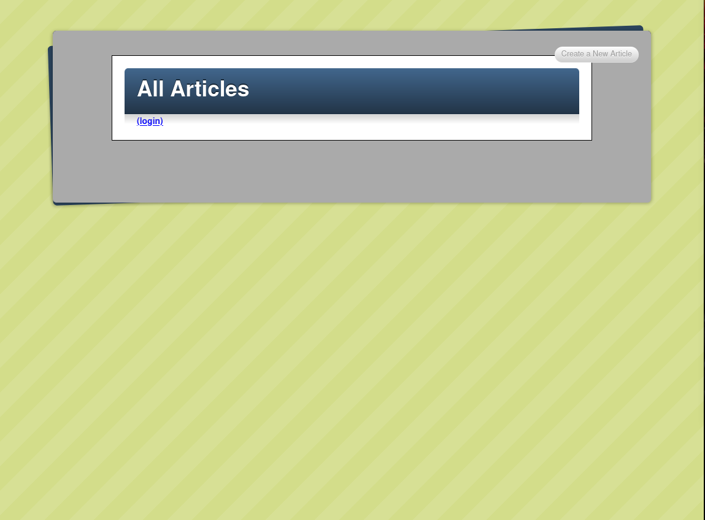

# Blogger App

> This is a basic Blog

## Built with

- Major language: Ruby.
- Frameworks: Rails.
- Techonologies used: This project was built using Ruby on Rails.

## Getting started

** This set of instructions is designed to be used in linux systems. **

To get a local copy up and running you just need to clone this repo, and delete the file /db/development.sqlite3
After you delete the file, just run rails db:migrate and you are ready to go. 
** You will need to use ruby 2.7.0 && rails 5.2.3 to avoid conclicts **

## Authors

👤 **Eduardo**

- Github: [@githubhandle](https://github.com/eduardoreisalvarenga)
- Twitter: [@twitterhandle](https://twitter.com/eduardodosrei11)
- Linkedin: [linkedin](https://www.linkedin.com/in/eduardo-alvarenga-44204818a/)

👤 **Oloo Moses**

- Github: [@githubhandle](https://github.com/oloomoses) 
- Twitter: [@twitterhandle](https://twitter.com/olooine)
- Linkedin: [linkedin](https://www.linkedin.com/in/oloo-moses-528bb1b3/)
